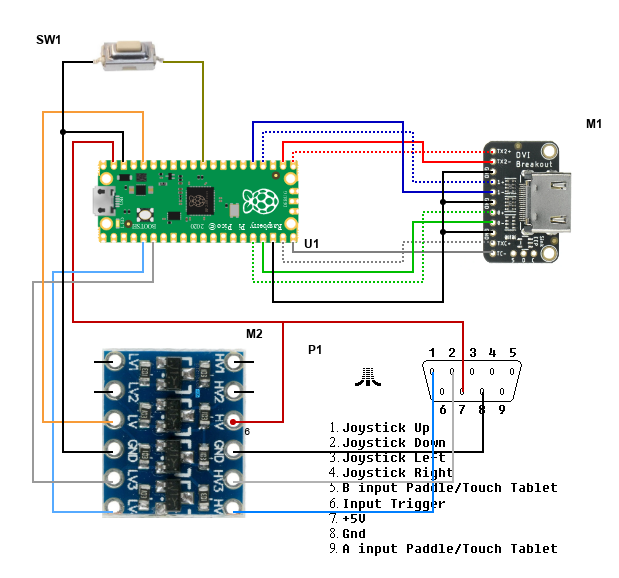

# XEP80-pico - hardware emulator of XEP80 

Using this picodvi library and the xep80 implementation from the repository https://github.com/OpenEmu/OpenEmu it is possible to create a hardware emulator of the XEP80 device.
The prototype is possible to build based on easily available modules.

The currently implemented emulation is not 100% compatible to the original XEP80. Only basic text mode works (original Atari 8x8 system font) in 4 predefined colors (frame, text, background and cursor). Graphics mode and printer port are not implemented)

I know two drivers with which this emulator can be used. *XEP80.SYS* from the SDX distribution and *ALTXEP80.SYS* located at https://atariwiki.org/wiki/Wiki.jsp?page=XEP80

Attention!
I do not guarantee the correct operation of the device made by you. The project requires basic knowledge of electronics. Improper connections or an error in the project may end up with a failure of the Atari, monitor or any of the components. When assembling the project yourself, you assume all responsibility.

## Bill of materials

| Element | Description                        | Example link                                             |
|---------|------------------------------------|----------------------------------------------------------|
| SW1     | Any single tactile switch          | https://www.adafruit.com/product/1489                    |
| M1      | Adafruit DVI Breakout Board        | https://www.adafruit.com/product/4984                    |
| U1 | RaspberryPi Pico                   | https://www.raspberrypi.com/products/raspberry-pi-pico/  |
| M2      | Bidirectional voltage level shiter | https://botland.com.pl/konwertery-napiec/6117-konwerter-poziomow-logicznych-dwukierunkowy-4-kanalowy-msx-5904422365189.html |
| P1      | Atari Joistick plug (with +5v wire) | https://pl.aliexpress.com/item/1005004568522392.html|

## Building and installing

1. Disconnect joystick cable from Atari Port and HDMI cable from TV
2. Executing  <code>make xep80</code> will build firmware for Rpi Pico
3. Switch pico to bootloader mode. Push BOOTSEL button when connecting pico with USB cable to PC
4. When RPi is mounted as removable device copy xep80.uf2 file from *build/apps/xep80* folder
5. Connect joystick port 2 and HDMI cable to TV
6. Turn on Atari
7. Under SDX execute command <code>ALTXEP80.SYS</code>
